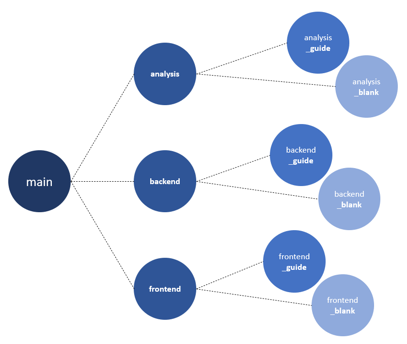
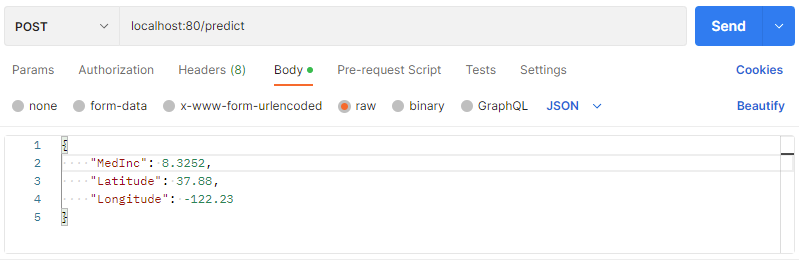

# Welcome :) Let's get started!

### This project consists of three major tasks:
1) **Analysis**: Analyse data and create a machine learning model.
2) **Backend**: Embed the machine learning model into a RESTful service.
3) **Frontend**: Design a graphical user interface to interact with the machine learning service.

The git branches of this project represent different stages of the project depending on your skills level. If you feel comfortable, you can start with the *blank* level of each section. The *blank* level contains task descriptions and some hints how to do so. If you need some more guidance, the *guide* level is recommended. The parent branch contains the solution - here you can look up difficult tasks or compare your own solution.

### Choose your starting point: 
- If you want to start with developing a machine learning model, then switch to branch analysis_guide and find tasks there. If you need some guidance, switch to branch analysis_guide and follow the step-by-step guide. In branch analysis you can find the final solution. 
- If you want to skip the machine learning part, you can also directly jump into the backend or the frontend part. **Depending on your skills level, choose either the *blank* or the *guide* starting point**.

### How to get there:
- Show all branches with <code>git branch -a</code>.
- Switch between branches with the checkout command from git. For example: <code>git checkout analysis_guide</code>.

# Backend

## Preparation 
- During the process it may be necessary to install some packages:  
    - pip install pydantic
    - pip install uvicorn
    - pip install fastapi
- Run [analysis.ipynb](./backend/analysis/analysis.ipynb) with button *Run All*. This will create the machine learning model file *model.joblib* in folder [artifacts](./backend/artifacts/). 
- If you developed your own machine learning model in the *analysis* level before, you can adjust the final model to your own favorites before exporting it (see last cell in jupyter notebook [analysis.ipynb](./backend/analysis/analysis.ipynb)).

## Step by step
The aim of this backend is to put the machine learning model into a RESTful service, which enables to call the prediction model in an easy and standardized way.

1) **Think before coding.** What are necessary building blocks? How would you structure the project? Think about a possible approach.

2) **Let's start.** First of all, let's try to bring the model from *model.joblib* to life. Put it into a class which can be used to make predictions. Continue implementation in [prediction_model.py](./backend/src/prediction_model.py).
3) The prediction model should be approachable via a REST call. Therefore, implement a REST endpoint. Continue implementation in [main.py](./backend/src/main.py).
4) You may noticed, that requestors post some data, which serves as input for the prediction model. Define an appropriate datatype. Continue implementation in [data_types.py](./backend/src/data_types.py).

5) **Let's see if it works!** If you think you are ready, run [main.py](/backend/src/main.py). Open a tool like postman and send a request to *localhost:80*. Do you get a response?

    

6) Optional: You can assure functionality of your implementation by setting up unit and integration **tests**. Find an example in [main__test.py](./backend/src/main__test.py). Run tests by entering command <code>pytest</code> in the terminal. Are all tests successful?