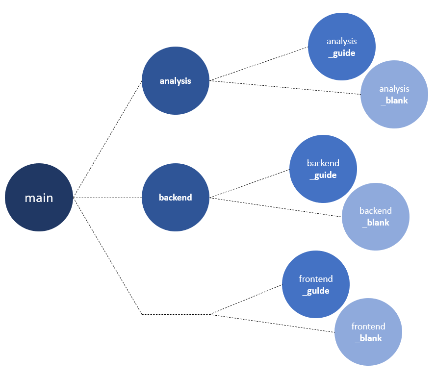

# Welcome :) Let's get started!

### This project consists of three major tasks:
1) **Analysis**: Analyse data and create a machine learning model.
2) **Backend**: Embed the machine learning model into a RESTful service.
3) **Frontend**: Design a graphical user interface to interact with the machine learning service.

The git branches of this project represent different stages of the project depending on your skills level. 

### Choose your starting point: 
- If you want to start with developing a machine learning model, then switch to branch analysis_blank. If you need some more guidance, switch to branch analysis_guide. In branch analysis you can find the final solution. 
- If you want to skip the machine learning part, you can also directly jump into the backend or the frontend part. **Depending on your skills level, choose either the *_blank* or the *_guide* starting point**.

### How to get there:
You can easily switch between branches with the checkout command from git. For example: <code>git checkout analysis_guide</code>.

# Analysis
## Preparation
1) Go to the Python website (https://www.python.org/downloads/) and **download** the latest version of **Python** for your operating system. Follow the installation instructions to install Python on your machine.
2) Open a command prompt or terminal window on your machine and install required **packages**: <code>pip install pandas matplotlib seaborn scikit-learn joblib</code>.
3) In order to work with **Jupyter Notebooks** (.ipynb-files), it may be necessary to download the appropriate **extension** in VSCode.
4) Let's start! Open file *analysis.ipynb* and follow the **step-by-step guide** there.

## Tips and tricks
- You can easily run jupyter cells with shortcut STRG + ENTER.

# Backend

## Preparation 
- During the process it may be necessary to install some packages:  
    - pip install pydantic
    - pip install uvicorn
    - pip install fastapi
- Run [analysis.ipynb](./backend/analysis/analysis.ipynb) with button *Run All*. This will create the machine learning model file *model.joblib* in folder [artifacts](./backend/artifacts/). 
- If you developed your own machine learning model in the *analysis* level before, you can adjust the final model to your own favorites before exporting it (see last cell in jupyter notebook [analysis.ipynb](./backend/analysis/analysis.ipynb)).

## Step-by-step guide
The aim of this backend is to put the machine learning model into a RESTful service, which enables to call the prediction model in an easy and standardized way.

1) **Think before coding.** What are necessary building blocks? How would you structure the project? Think about a possible approach.

2) **Let's start.** First of all, let's try to bring the model from *model.joblib* to life. Put it into a class which can be used to make predictions. Continue implementation in [prediction_model.py](./backend/src/prediction_model.py).
3) The prediction model should be approachable via a REST call. Therefore, implement a REST endpoint. Continue implementation in [main.py](./backend/src/main.py).
4) You may noticed, that requestors post some data, which serves as input for the prediction model. Define an appropriate datatype. Continue implementation in [data_types.py](./backend/src/data_types.py).

5) **Let's see if it works!** If you think you are ready, run [main.py](/backend/src/main.py). Open a tool like postman and send a request to *localhost:80*. Do you get a response?

    

# Frontend
## Preparation
- Download nodejs https://nodejs.org/en/download/
- cd src
- npm create vite@latest frontend -- --template react
- cd frontend
- **npm install**
- **npm run dev**
- open link http://localhost:5173/ in your browser
- see the default webpage
- find the corresponding source code in App.jsx
- the styling is defined in App.css
- use this template to build your own webpage

## Step-by-step guide
Make it look good:
- Replace the headline 
- Replace the two logos with an image about California
- Add some numerical input fields
- Adjust the button

Make it work:
- npm install axios
- 