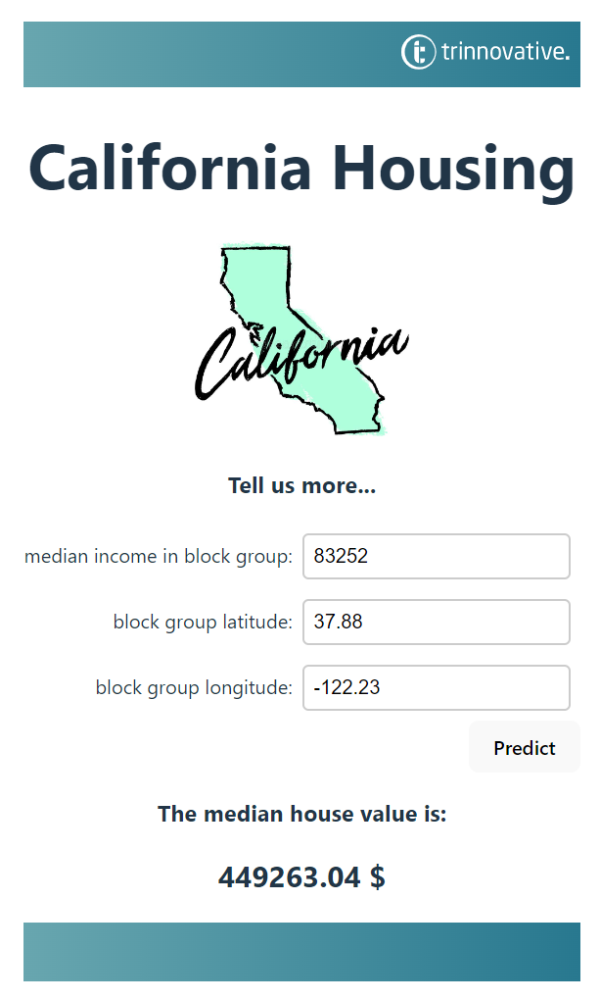

# Branches

- master: complete project
- dev_frontend
- dev_backend

# Frontend

- Download nodejs https://nodejs.org/en/download/
- cd src
- npm create vite@latest frontend -- --template react
- cd frontend
- npm install
- npm run dev
- open link http://localhost:5173/ in your browser
- see the default webpage
- find the corresponding source code in App.jsx
- the styling is defined in App.css
- use this template to build your own webpage

Make it look good:
- Replace the headline 
- Replace the two logos with an image about California
- Add some numerical input fields
- Adjust the button

Make it work:
- npm install axios
- 

Hallo! 
Schön dass du dich zu unserem Praxistag angemeldet hast. Wir freuen uns auf dich!
In der Hands-On Coding Session möchten wir dir praktische Einblicke in die Arbeit als Softwareentwickler/in geben.Dazu werden wir gemeinsam ein kleines Projekt programmieren: Mit Hilfe von Python werden wir ein Machine Learning Modell entwickeln und dieses in einen REST Service verpacken. Schließlich basteln wir noch ein ansprechendes REACT Frontend, mit welchem wir unser Modell interaktiv nutzen können. Aber keine Sorge - alles Schritt für Schritt und natürlich mit unserer Unterstützung! So kannst du ganz intuitiv die verschiedenen Facetten der Softwareentwicklung kennenlernen und rausfinden, was dir am meisten Spaß macht. 

Gerne kannst du dafür schon Folgendes auf deinem Laptop vorbereiten:
- IDE (Wir empfehlen VSCode -> https://code.visualstudio.com/download)
- Git (https://git-scm.com/downloads)
- Python (https://www.python.org/downloads/)
- NodeJS (https://nodejs.org/en/download/)